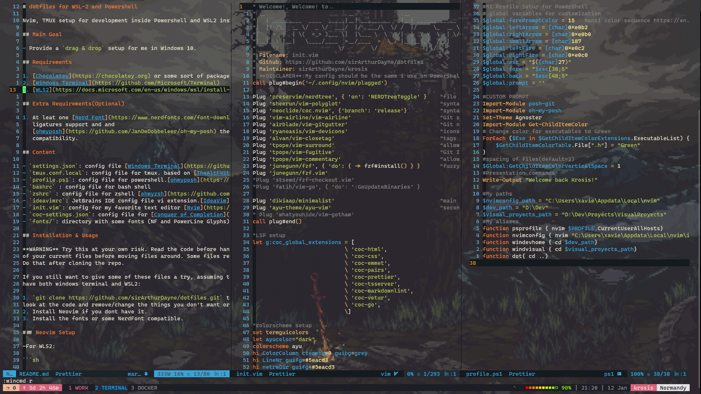

# dotfiles for WSL-2 and Powershell

Nvim, TMUX setup for development inside Powershell and WSL2 inside WindowsTerminal.



## Main Goal

- Provide a `drag & drop` setup for me coding in Windows 10.
- Provide a simple script `install` for easy neovim structure and file linking.

## Requirements

1. [Chocolatey](https://chocolatey.org) or some sort of package manager.
2. [Windows Terminal](https://github.com/Microsoft/Terminal)
3. [Neovim](https://github.com/neovim/neovim)
4. [WSL2](https://docs.microsoft.com/en-us/windows/wsl/install-win10)

## Extra Requirements(Optional)

1. At leat one [Nerd Font](https://www.nerdfonts.com/font-downloads). For
   ligatures support and and
   [ohmyposh](https://github.com/JanDeDobbeleer/oh-my-posh) themes
   compatibility.

## Content

### Files

- `settings.json`: config file [Windows Terminal](https://github.com/Microsoft/Terminal)
- `tmux.conf.local`: config file for tmux. based on [TheAltF4Stream](https://github.com/awesome-streamers/awesome-streamerrc/blob/master/TheAltF4Stream/.tmux.conf.local)
- `profile.ps1`: config file for powershell.[ohmyposh](https://github.com/JanDeDobbeleer/oh-my-posh) is required!
- `bashrc` : config file for bash shell
- `zshrc` : config file for zshell [ohmyzsh](https://github.com/ohmyzsh/ohmyzsh) is required!
- `ideavimrc`: JetBrains IDE config file vi extension.[IdeaVim](https://github.com/JetBrains/ideavim)
- `init.vim`: config for my favorite text editor [Nvim](https://github.com/neovim/neovim)
- `coc-settings.json`: config file for [Conquer of Completion](https://github.com/neoclide/coc.nvim)
- `.ripgreprc`: config file for [RipGrep](https://github.com/BurntSushi/ripgrep)

### Directories

- `fonts/`: directory with some fonts (NF and PowerLine Glyphs) compatible. `.ttf` extension.
- `plugin/`: directory that hold config files for some nvim pluggin.

> NOTE: see my currently pluggin list inside my init.vim file.

### Scripts

- `install`: script that handles all linking of nvim files from my dotfiles to
the `~/.config/nvim` path. based on [ThePrimeagen](https://github.com/awesome-streamers/awesome-streamerrc/blob/master/ThePrimeagen/install)

## Installation & Usage

**WARNING** Try this at your own risk. Read the code before hand and make backups
of your current files before moving files around. Some files required you to modify some path for proper usage.
Do that after cloning the repo.

If you still want to give some of these files a try, assuming that you already
have both windows terminal and WSL2:

1. `git clone https://github.com/sirArthurDayne/dotfiles.git` the repo, take a
look at the code and remove/change the things you don’t want or need.
2. Install Neovim if you dont have it.
3. Install the fonts or some NerdFont compatible.

### Neovim Setup

#### For WSL2

```sh

mkdir -p ~/.config/nvim/
ln -s init.vim ~/.config/nvim/init.vim
cp coc-settings.json ~/.config/nvim/coc-settings.json

```

-alternative: run the script

```sh
./install
```

#### For Powershell

```sh

mkdir -p ~/.config/nvim/
cp init.vim ~/Appdata/Local/nvim/init.vim
cp coc-settings.json ~/Appdata/Local/nvim/coc-settings.json

```

Execute `nvim` inside any shell type`:PLugInstall`, after that, restart nvim
for proper load.

> NOTE: do this last step for both Powershell and inside WSL2.

### Other Files Setup

Link the rest of the files to the `/HOME` directory inside your WSL2 instance.

### Future Plans

- [x] Create a script that makes path and links for faster setup in WSL2.
