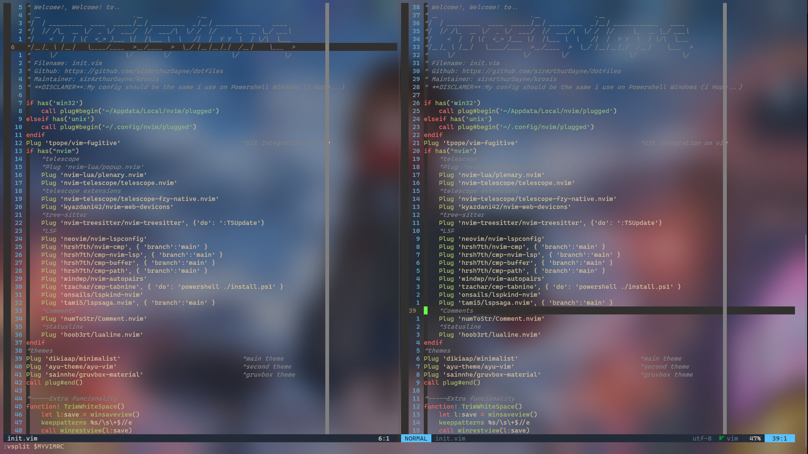

# dotfiles for WSL-2 and Powershell

My developer setup for Powershell/PowershellCore and WSL2 inside Windows Terminal



## Main Goal

- Provide a `drag & drop` setup for me coding in Windows 10/11.
- Easy to install for both WSL2 and Powershell/PowershellCore

## Requirements

1. [Chocolatey](https://chocolatey.org) or some sort of package manager.
2. [Windows Terminal](https://github.com/Microsoft/Terminal)
3. [Neovim 0.7>=](https://github.com/neovim/neovim)
4. [WSL2](https://docs.microsoft.com/en-us/windows/wsl/install-win10)
5. [Nerd Font](https://www.nerdfonts.com/font-downloads)
6. [ohmyposh](https://ohmyposh.dev/docs/)

## Content

### File Structure

- `.config`: holds all of my programs config files
- `.config/nvim`: text-editor config (compatible with both OS)
- `.config/PowerShell`: directory for All PowerShell/PowershellCore setup. *Affected by `install.ps1`*

### Files

- `settings.json`: config file [Windows Terminal](https://github.com/Microsoft/Terminal)
- `tmux.conf.local`: config file for tmux. based on [TheAltF4Stream](https://github.com/awesome-streamers/awesome-streamerrc/blob/master/TheAltF4Stream/.tmux.conf.local)
- `profile.ps1`: config file for powershell.[ohmyposh](https://github.com/JanDeDobbeleer/oh-my-posh) **is required!**
- `krosis.omp.json`: oh-my-posh custom theme.[ohmyposh](https://github.com/JanDeDobbeleer/oh-my-posh)
- `bashrc` : config file for bash shell
- `zshrc` : config file for zshell [ohmyzsh](https://github.com/ohmyzsh/ohmyzsh) is required!
- `ideavimrc`: JetBrains IDE config file vi extension.[IdeaVim](https://github.com/JetBrains/ideavim)
- `init.vim`: config for my favorite text editor [Nvim](https://github.com/neovim/neovim)
- `.ripgreprc`: config file for [RipGrep](https://github.com/BurntSushi/ripgrep)


### Scripts
- `install`: script that handles all linking of nvim files from my dotfiles to

## Installation & Usage

**WARNING** Try this at your own risk. Read the code beforehand and make backups
of your current files before moving files around. Some files required you to modify some path for proper usage.
Do that after cloning the repo.

1. `git clone https://github.com/sirArthurDayne/dotfiles.git` the repo, take a
look at the code and remove/change the things you don’t want or need.
2. Install Neovim if you dont have it.
3. Install the fonts or some NerdFont compatible.

### Neovim Setup

#### For WSL2
Execute:
```sh
./install.sh
```
#### For Powershell
Execute:
```ps1
./install.ps1
```
Execute `nvim` inside any shell type`:PLugInstall`, after that, restart nvim
for proper load.
> NOTE: do this last step for both Powershell and inside WSL2.

Dotfiles Based on [ThePrimeagen](https://github.com/awesome-streamers/awesome-streamerrc/blob/master/ThePrimeagen)
